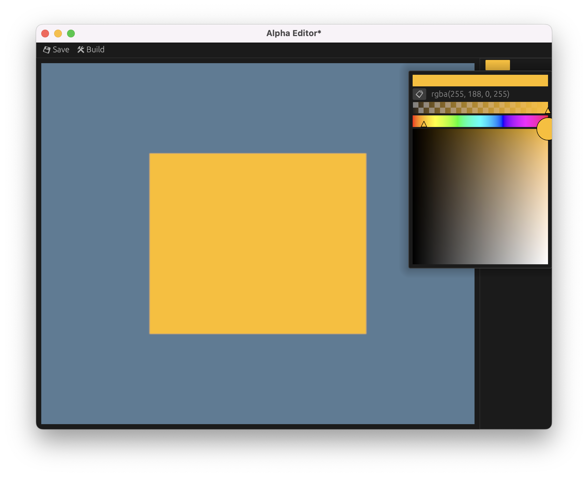
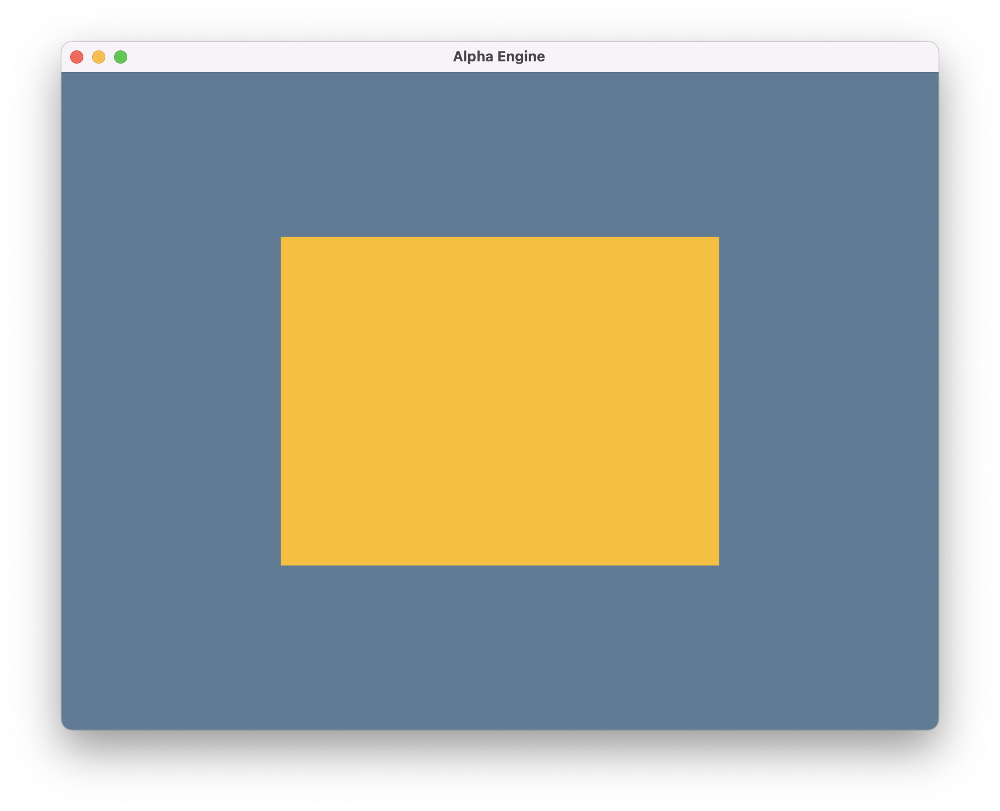

# Rendering a rectangle in editor and game

Following on from the _very_ high level architecture outlined in [Starting out](./001_starting_out.md), I built a very basic editor and game.




The editor uses `egui` to provide the user interface; windowing is provided by the `winit` crate and access to the GPU is via `wgpu`.
The game renders a hardcoded rect (it's actually a square, but there's some aspect ratio work that needs to be done before that's evident).
The editor allows me to choose the colour of the rect, with changes visible in real time by offscreen rendering and displaying that in the UI.
I can save the changes in the editor without changing the actual game; I can also build the game which causes the changes to be reflected there.
Everything is happening in the same thread, currently, although multi-threading might be a useful future enhancement.
The implementation for all of these features is pretty basic, but it gives me a scaffold to work from to build out more functionality.
I've learned a lot by implementing this functionality, which I'll try to summarise in the sections below.

## Setting up egui

Getting egui up and running was a bit more challenging that I'd have liked.
I was surprised to see that the default graphics backend is the fantastic `glow` crate (GL on Whatever), not WGPU.
There is a `egui_wgpu_backend` crate, which I am using, as well as `egui_winit_platform` due to my choice of tech stack.
Once I'd got these dependencies in place, I had hoped for a quick setup, but the `egui` examples rely on their `eframe` crate, which uses `glow`.
The [egui_example](https://github.com/hasenbanck/egui_example) repository provides some WGPU and winit examples, but it also uses a framework.
I needed to use my engine directly, because of the previous architecture decision that the editor was going to call into the game at the right times in the game loop.
Fortunately, using these examples, I was able to get egui configured.

Looking at it now, it seems quite simple:

1. Setup `wgpu`.
2. Setup `egui_winit_platform`.
3. Setup `egui_wgpu_backend`.
4. Each frame:
   1. Pass `egui` the current time.
   2. Begin the frame.
   3. Get the `egui` context from the platform.
   4. Do UI stuff.
   5. End the frame.
   6. Submit the frame to the backend render pass.

I think much of the challenge came from my experience of setting up ImGui in C++, which involved including a couple of headers and making a few function calls.
I expected `egui` to be similar, but due to my design choices, I was exposed to configuring the renderer and other aspects that these implementations encapsulate.
Due to my inexperience with modern graphics programming, I found terminology such as render pass added to my confusion.
It wasn't really until I started to implement offscreen rendering in `wgpu` so that I could display the game in the editor that I had some eureka moments.

## Rendering with WGPU

Most of the graphics work I've done has been following various OpenGL tutorials.
Beside working through the excellent [Learn WGPU](https://sotrh.github.io/learn-wgpu/) tutorial, I've not got any experience with WGPU.
One of the biggest challenges I found was understanding how to use pre-defined render pipelines and how they related to render passes.
To get things working initially, I just copy/pasted the code from the WGPU tutorial and edited it as I needed.
Once I'd been playing with the WGPU API for a while and after some research, I made 2 discoveries that really helped my understanding:

1. A render pipeline is a collection of shaders, textures, etc., that are executed to render part of a scene.
2. A render pass is the pipelines and draw calls needed to produce the desired output.

What this means might not seem obvious at first; it wasn't for me, so I'm going to try and explain them a bit more using reference to OpenGL concepts where appropriate.
A render pipeline and render pass, as I currently understand it, is basically the following (clearly not actual) OpenGL:

```
shader = glCreateShader();
vertex_buffer = glCreateVertexBuffer(vertices);
element_buffer = glCreateElementBuffer(indices);
vao = glCreateVertexArray(vertex_buffer, element_buffer);

glBindShader(shader);
glBindVertexArray(vao);
glDrawIndexed(TRIANGLES, 6);
```

I've split this code example into 2 sections; the first is what I'll call the pipeline definition stage and the second is the pipeline execution stage.
The pipeline definition stage happens once to setup the necessary shaders, the pipeline execution stage happens every frame.

### Render pipelines

From the above example, the render pipeline definition would be:

```
shader = glCreateShader();
vertex_buffer = glCreateVertexBuffer(vertices);
element_buffer = glCreateElementBuffer(indices);
vao = glCreateVertexArray(vertex_buffer, element_buffer);
```

In WGPU, the pipeline definition step is a bit more verbose than in OpenGL, but I don't think too much more and I like that it keeps all related details together:

```rust
pub struct RectPipeline {
    pub render_pipeline: RenderPipeline,
    pub vertex_buffer: Buffer,
    pub index_buffer: Buffer,
    pub index_buffer_format: wgpu::IndexFormat,
}

impl RectPipeline {
    const INITIAL_RECT_COUNT: usize = 1;

    pub fn init(device: &Device, surface_config: &SurfaceConfiguration) -> Self {
        let shader = device.create_shader_module(&ShaderModuleDescriptor {
            label: Some("Shader"),
            source: ShaderSource::Wgsl(include_str!("../resources/shaders/rect.wgsl").into()),
        });

        let render_pipeline_layout = device.create_pipeline_layout(&PipelineLayoutDescriptor {
            label: Some("Render Pipeline Layout"),
            bind_group_layouts: &[],
            push_constant_ranges: &[],
        });

        let render_pipeline = device.create_render_pipeline(&RenderPipelineDescriptor {
            label: Some("Render Pipeline"),
            layout: Some(&render_pipeline_layout),
            vertex: VertexState {
                module: &shader,
                entry_point: "vs_main",
                buffers: &[Vertex::desc()],
            },
            fragment: Some(FragmentState {
                module: &shader,
                entry_point: "fs_main",
                targets: &[ColorTargetState {
                    format: surface_config.format,
                    blend: Some(BlendState::REPLACE),
                    write_mask: ColorWrites::ALL,
                }],
            }),
            primitive: PrimitiveState {
                topology: PrimitiveTopology::TriangleList,
                strip_index_format: None,
                front_face: FrontFace::Ccw,
                cull_mode: Some(Face::Back),
                polygon_mode: PolygonMode::Fill,
                unclipped_depth: false,
                conservative: false,
            },
            depth_stencil: None,
            multisample: MultisampleState {
                count: 1,
                mask: !0,
                alpha_to_coverage_enabled: false,
            },
            multiview: None,
        });

        let vertex_buffer = device.create_buffer(&BufferDescriptor {
            label: Some("Vertex Buffer"),
            size: (std::mem::size_of::<Vertex>() * 4 * Self::INITIAL_RECT_COUNT as usize)
                as BufferAddress,
            usage: BufferUsages::VERTEX | BufferUsages::COPY_DST,
            mapped_at_creation: false,
        });

        let index_buffer = device.create_buffer(&BufferDescriptor {
            label: Some("Index Buffer"),
            size: (std::mem::size_of::<u16>() * 6 * Self::INITIAL_RECT_COUNT as usize)
                as BufferAddress,
            usage: BufferUsages::INDEX | BufferUsages::COPY_DST,
            mapped_at_creation: false,
        });

        let index_buffer_format = wgpu::IndexFormat::Uint16;

        RectPipeline {
            render_pipeline,
            vertex_buffer,
            index_buffer,
            index_buffer_format,
        }
    }
}
```

This follows the same steps as with OpenGL: load the shaders, (setup a few other bits that in OpenGL might be done elsewhere), define the vertex buffer and the index buffer.
Since I'm only rendering one rect, I could define the vertices and indices as a constant, but instead I create a buffer that can be updated and resized to accommodate multiple elements.
We keep a reference to the buffers and the pipeline so that they can be reused in the game loop.

```rust
render_pass.set_pipeline(&self.rect_pipeline.render_pipeline);
render_pass.set_vertex_buffer(0, self.rect_pipeline.vertex_buffer.slice(..));
render_pass.set_index_buffer(
    self.rect_pipeline.index_buffer.slice(..),
    self.rect_pipeline.index_buffer_format,
);
render_pass.draw_indexed(0..indices.len() as u32, 0, 0..1);
```

Again, this render pipeline execution is very similar to what is required in OpenGL.
However, what we haven't looked at yet is what render passes are analogous to in OpenGL; let's do that now.

### Render passes

From the above example OpenGL-esque code, the render pass consists of the following:

```
glBindShader(shader);
glBindVertexArray(vao);
glDrawIndexed(TRIANGLES, 6);
```

That's it - a render pass is the code needed to execute a render pipeline.
This was a groundbreaking realisation for me, but it took until I was trying to implement writing to a framebuffer for offscreen rendering in `egui`.
Once I realised that a first render pass was needed to render my game scene to a texture and then a second to render that texture in `egui` (with the rest of the UI), the penny dropped.

## Saving state and building the game

I wanted to implement a first pass at saving editor files and building a game as separate steps.
I currently use a text file to store the RGBA colour of the triangle - one file for the editor and another for the game.
Saving in the editor updates the editor config file but not that of the game.
Building in the editor copies the contents of the editor config into the game config file.
Currently, the file names are hardcoded, but this will eventually change - at least for the editor.
I also want to move over to using `ron` (Rusty Object Notation) which can be serialised/de-serialised with `serde`.
The entrypoint files for the game and editor are currently still the simple binary files in the `src` - I hope to keep them this way for as long a spossible.

## Challenges

I found it difficult to abstract a renderer that doesn't expose all of the `wgpu` internals.
Part of the problem is due to Rust's ownership model - I need to use an `encoder` to create multiple render passes, but the encoder takes ownership of itself for the lifetime of a single render pass.
Not allowed.
Given that this is an engine I am building rather than a framework, thing might not be such a problem.
However, I'd like to build some helpful abstractions around the WGPU API as these can help make for a more powerful renderer.
I think as I learn more about the role of the `instane`, `adapter`, `device` and `surface`, I'll be able to make better decisions about abstraction.

[View the code](https://github.com/junglie85/alpha/tree/f744e8370dcd65d065348fb1e2a3d6e2ac6285c4) on GitHub.
